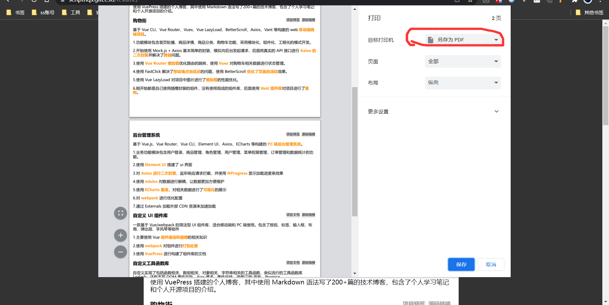

# 个人简历

## 介绍

使用纯 HTML + CSS 写的简历

## 特点

Markdown 风格，支持响应式，使用 ctrl + p 打印，可以另存为 PDF 格式。

具体操作：

在页面手动 Ctrl + P 都能将当前页进行打印预览。在打印预览的时候我们更改打印方式，选择将页面保存为 PDF 即可实现页面保存为 PDF 的功能。

Gitee 网站：<https://scripthqs.gitee.io/resume>
